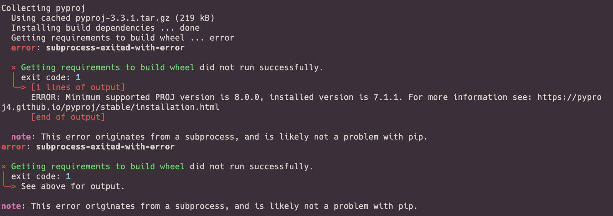

# Maesters of NWP(numercial weather prediction)

- A repository focus on how to fecth open-source global numerical weather prediction product. 
  - Deutscher Wetterdientst - ICON
  - European Centre for Medium-Range Weather Forecasts - OPER / ENFO
  - Canadian Meteorological Center - GEM / GEPS


## How to install

### Dependence
1. cdo ([install cdo via conda](https://anaconda.org/conda-forge/cdo))
```shell
conda install -c conda-forge cdo
```
2. curl ([install curl via conda]())
```shell
conda install -c conda-forge curl
```

### Install
```shell
pip install maesters-nwp
```
### Usage
``` python
from maester import Maesters

ec = Maester('ecmwf','oper','2022-06-29 12:00',hour=[6,30],varname='TP_L0')

# get xarray object
ec.xarray()

# or only download (if lcoal_dir is not given, default download to $HOME/data/{source}/{product}/{date:%Y%m%d%H0000}/)
ec.download(local_dir='./') 
```
### Probrem
problem1: pyporj instal fail in M1 chip


solve1: 
```shell
brew install proj
pip install pyproj
```

